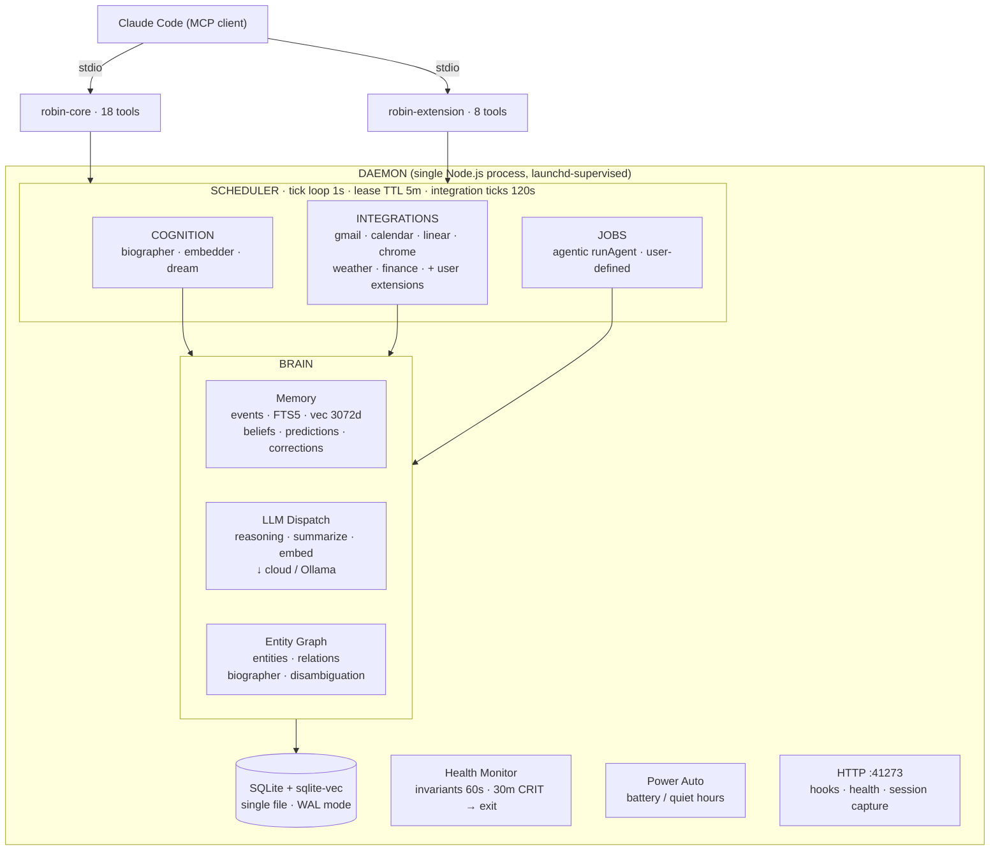

# Robin

> Local-first personal AI assistant with long-term memory, background integrations, and a skills system — driven by Claude Code via MCP.

Robin is a daemon that runs on your machine. It captures your Claude Code sessions, pulls data from your accounts (Gmail, Calendar, Linear, and any API you add an extension for), builds an entity–relation knowledge graph in SQLite, and exposes everything as MCP servers that Claude Code talks to. After setup, Robin works in the background — you don't type `robin` commands; Claude does the driving through MCP, and Robin remembers across sessions.

## Quick start

```bash
nvm use 24                       # Node 24 required (.nvmrc)
pnpm add -g robin-assistant      # or: npm i -g robin-assistant
robin init --yes                 # one-time setup: daemon, MCP servers, capture hooks, schema
```

That's the only command you run. `init` installs the launchd daemon (macOS), registers Robin's MCP servers in `~/.claude.json`, and installs the Claude Code capture hooks. Open Claude Code anywhere on your machine and Robin's MCP tools (`mcp__robin__*`) are available automatically. Run `robin doctor` any time to check health.

## Requirements

| Requirement | Notes |
|---|---|
| **Node 24** | Pinned via `.nvmrc`. `better-sqlite3` is a native binding; the ABI must match. |
| **macOS or Linux** | On macOS, `robin init` installs the launchd autostart. On Linux, run the daemon under systemd/runit/etc. |
| **An LLM provider** | At least one of: a cloud API key (Anthropic, Google, DeepSeek) or **Ollama** for local inference. Roles are mapped in `models.yaml` (see [LLM dispatch](#llm-dispatch)). |

`robin init` seeds a cloud-first config; add a key and you're running. Ollama is the local, zero-cost alternative — Apple Silicon recommended. The embedding vector dimension is fixed by the schema (currently 3072), so your embed model must output that size.

## Architecture



### Three layers

```
system/        Framework: kernel (daemon + scheduler), brain (memory + cognition),
               integrations runtime, surfaces (CLI, HTTP, MCP), skills
user-data/     Per-user instance: memory, secrets, extensions, knowledge files (gitignored)
dist/          Compiled output (gitignored); pnpm build to regenerate
```

### The daemon

A single Node.js process, supervised by launchd (macOS). It owns the scheduler, health monitor, integration lifecycle, and HTTP hook receiver. On startup it loads secrets from `user-data/config/secrets/.env`, applies migrations, wires integrations into cron jobs, and starts the tick loop.

The **scheduler** claims one pending job per tick (1s interval) and re-arms cron jobs on completion — even on failure, so a transient error can't permanently silence a schedule. **Integration ticks** run inside a 120s timeout so a hung API call can't wedge the loop; **cognition and user jobs are not wrapped** — they intentionally run longer, bounded by their own per-call LLM timeouts and (for agentic runs) the SDK budget. A 60s lease reaper recovers jobs abandoned by crashed handlers, and orphaned tick crons left behind by a removed integration are garbage-collected at startup. If the tick loop itself hangs, the health monitor escalates through a 30-minute sustained-CRITICAL gate and then `exit(1)`s for launchd respawn.

### Memory

Everything Robin knows lives in a single SQLite file, with three ways to find it again:

- **Events** — the raw log. Every session, integration tick, belief, prediction, and daily briefing is an event. Append-only — nothing is deleted, only superseded.
- **Search** — full-text (FTS5) for keyword lookup, vector embeddings (3072-dim, cloud or local) for semantic similarity, and entity-graph traversal for "who is connected to what." When you call `recall`, Robin picks the best mode or blends all three.
- **Entity graph** — people, places, tools, and services, connected by relations the biographer extracts from your conversations. This is how Robin knows "Jake Lee" is connected to "HostMind" and "Monday evening sync."

On top of the event stream, Robin maintains three structured stores for reasoning:

- **Beliefs** — what Robin currently thinks is true, organized by topic. When new data contradicts an old belief, the new one auto-supersedes it. You can query current truth with `recall_belief`.
- **Predictions** — forecasts with confidence levels and deadlines. The dream job grades them and tracks calibration over time.
- **Corrections** — what Robin said wrong and the correction. These feed back into the biographer's prompts as few-shot examples.

### Cognition

Three background jobs do Robin's thinking:

- **Biographer** — reads your Claude Code sessions and extracts who/what/where into the entity graph. Processes sessions in chunks across multiple cron ticks, so a long conversation doesn't block everything else. If Ollama goes down, the biographer pauses rather than writing empty results.
- **Embedder** — turns event content into vector embeddings for semantic search. Runs every minute, picking up anything the ingest path left un-embedded.
- **Dream** — the nightly consolidation pass: resolves overdue predictions (and scores their calibration), rolls up daily metrics, regenerates profiles for the day's most-active entities, clusters recent sessions into narrative arcs, expires stale belief candidates, and writes a journal entry. The deterministic steps run with no model; the summarization steps degrade gracefully when no LLM is available.

### LLM dispatch

Robin routes each kind of work to a model by **role**, defined in `user-data/config/models.yaml`. Providers can be cloud (`anthropic`, `google`, `deepseek`) or local (`ollama`) — mix freely per role:

```yaml
roles:
  reasoning: { provider: google,    model: gemini-3.1-pro-preview }   # biographer extraction
  summarize: { provider: anthropic, model: claude-fable-5 }           # quality-sensitive synthesis
  embed:     { provider: google,    model: gemini-embedding-2, embedDims: 3072 }
  # all-local alternative — uncomment to run with zero cloud spend:
  # reasoning: { provider: ollama, model: qwen3:14b }
  # embed:     { provider: ollama, model: qwen3-embedding:8b }
```

Every call passes through one dispatcher chokepoint: wrapped in `withTimeout` (default 5 min, overridable per-call), and metered against a **daily USD spend cap** (`ROBIN_LLM_DAILY_USD_CAP`, default $10 once any cloud provider is in play). The cap throws cleanly rather than burning money on a runaway loop, and callers treat it like a transient outage — no half-written results. Providers register with `lenient: true`, so a missing secret produces a warning, not a crash. The embed model must output the schema's vector dimension (3072); switching embedders means `robin reindex --force`.

### Agentic execution

Plain LLM calls (`llm.invoke`) answer one question. Some work needs an **agent** — a multi-turn tool loop that explores memory, follows threads, and produces structured output. Robin runs these through one guarded primitive, `runAgent`, and bans every other path (no `claude -p` shell-outs, no ad-hoc nested sessions). That single chokepoint makes an open-ended loop *auditable instead of opaque*:

- **Ledger-accounted** — one usage row per run (tokens, cost, status).
- **Tool-allowlisted** — an explicit `allowedTools` set, never "all." Read-only runs also pass `disallowedTools` to deny the write builtins (`Write`/`Edit`/`Bash`), since an allowlist alone doesn't gate built-in tools.
- **Capped** — every run is bounded by `maxTurns`, `timeoutMs`, `maxBudgetUsd`, and a per-surface daily ceiling. It returns a status (`success` / `capped` / `timeout` / `error`) rather than throwing, so a cap is a clean stop, not a crash.
- **Isolated** — write-capable runs execute in a git worktree, behind an OS sandbox.
- **Auditable** — every run streams a full JSONL transcript to `user-data/agent-runs/`.

User jobs invoke it for things like a nightly synthesis pass; it's also exposed to Claude Code via the `agent` tool on robin-extension.

### Capture pipeline

A Claude Code hook (`~/.claude/settings.json`, installed by `robin init`) POSTs session transcripts to the daemon's HTTP server on session end. The daemon projects the JSONL into turns, applies skip rules (short sessions, out-of-scope CWD), deduplicates by content hash, and writes a `session.captured` event. The biographer picks these up on its next cron tick.

For the full deep dive — database schema, integration contract, scheduler internals, and all invariants — see [`docs/ARCHITECTURE.md`](docs/ARCHITECTURE.md).

### Integrations

Integrations connect Robin to external data sources. Each is a directory with an `integration.yaml` manifest and an `index.ts` exporting a `tick()` function. The daemon runs them on their cron schedule — every 15 minutes for Gmail, every 30 for Calendar, every 12 hours for eBird, etc.

An integration tick pulls data from an API, normalizes it, and calls `ingest()` to write events into the database. The ingest path handles content-hash dedup, so a tick that returns the same data twice doesn't create duplicate events. Each tick records a heartbeat (`last_attempt_at`, `last_ingest_count`, `consecutive_errors`) that the health monitor and the daily brief read to detect degradation.

**8 ship built-in** (Gmail, Calendar, Linear, Chrome history, weather, finance quotes, Claude Code session capture, notifications). **User extensions** live in `user-data/extensions/integrations/` and are loaded identically — the daemon's file watcher hot-reloads them on change, no restart required, and that's where you'd add your own (Whoop, eBird, Spotify, a bank feed, anything with an API).

OAuth integrations (Gmail, Calendar) rotate tokens on Google's 7-day testing-mode cycle. `robin reauth <name>` opens a one-shot local OAuth flow: browser consent → localhost callback → new refresh token written to `.env` → daemon bounced.

### Skills

Skills are reusable, named methodologies — a directory with a `SKILL.md` (plus optional reference files). Robin serves skill content via the `skill` MCP tool; it never executes anything — the MCP client (Claude Code) reads and runs bundled scripts itself.

- **System skills** (`system/skills/builtin/`) ship with the package.
- **User skills** (`user-data/extensions/skills/`) are personal, gitignored. A user skill with the same name shadows a system skill.

### MCP servers

Robin exposes two MCP servers (stdio transport, configured via `.mcp.json`):

| Server | Tools | Purpose |
|---|---|---|
| **robin-core** | `recall`, `remember`, `find_entity`, `get`, `list`, `predict`, `believe`, `recall_belief`, `review_beliefs`, `resolve_belief_candidate`, `record_correction`, `audit`, `explain`, `health`, `metrics`, `journal`, `power`, `skill` | Memory, cognition, and self-model |
| **robin-extension** | `run`, `integration_status`, `ingest`, `related_entities`, `resolve_prediction`, `check_action`, `update`, `agent` | Job/integration control, graph traversal, agentic runs |

Copy `.mcp.json.example` to `.mcp.json` and adjust paths to connect.

### The self-learning loop

Robin improves over time through three feedback mechanisms:

1. **Corrections** — when Robin says something wrong, `record_correction` logs the error and the fix. The biographer's prompt includes recent corrections as few-shot examples, so the same mistake tends not to recur.
2. **Beliefs** — `believe` persists a topic-keyed claim that auto-supersedes the prior belief for that topic. `recall_belief` returns current truth without embedding search. Wrong predictions fold into belief-updates as retractions.
3. **Predictions** — `predict` logs a confidence-calibrated forecast with a deadline. The dream job resolves overdue predictions and computes Brier scores for calibration tracking.

### Configuration

All user-editable config lives in `user-data/config/`:

- `models.yaml` — LLM role → provider + model mapping
- `policies.yaml` — power/capture/network state, auto-policies (battery threshold, quiet hours)
- `hardware.yaml` — detected hardware profile (written by `robin init`)
- `secrets/.env` — environment-style secrets (mode 0600); loaded by the daemon at startup

The `system/` directory ships no config files — only TypeScript code.

## Development

```bash
cd robin-assistant
nvm use                                     # Node 24 via .nvmrc
pnpm install
ROBIN_USER_DATA_DIR=./user-data pnpm dev    # daemon in foreground
pnpm test                                   # ~700 tests (node --test)
pnpm typecheck && pnpm lint                 # tsc --noEmit + biome
```

Before contributing, read:
1. [`docs/ARCHITECTURE.md`](docs/ARCHITECTURE.md) — how Robin is built
2. [`docs/STATUS.md`](docs/STATUS.md) — current implementation snapshot
3. [`docs/BACKLOG.md`](docs/BACKLOG.md) — deferred work
4. [`docs/CONTRIBUTING.md`](docs/CONTRIBUTING.md) — workflow, code style, CI

## Open-source posture

- **License:** MIT
- **Reference platform:** M5 Max 64 GB (Apple Silicon, Ollama). Other hardware degrades into smaller models or cloud-only mode.
- **Personal data** lives in `user-data/` (gitignored). For multi-machine sync, use a private companion repo containing `user-data/` minus `state/db/`.
- **Security:** report issues via GitHub private security advisories (see [`docs/SECURITY.md`](docs/SECURITY.md)).

## License

[MIT](./LICENSE)
